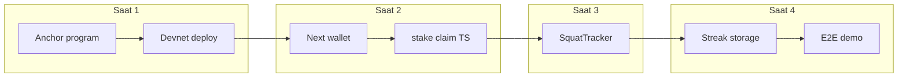

# FitStake Hackathon — 4 Saatlik Savaş Planı (TPM)

Kaynaklar: [project_overview.md](docs/project_overview.md), [solana_anchor_specs.md](docs/solana_anchor_specs.md), [vision_ai_specs.md](docs/vision_ai_specs.md).

**Temel kısıtlar:** Gerçek veritabanı yok; streak/gün takibi `localStorage` veya basit API bellek değişkeni. Ödül matematiği sade: önce **çalışan `stake` + `claim`**, sonra demo cilası. **Devnet** hedefi.

---

## Zaman çizelgesi (saat saat)

| Faz                  | Süre                    | Odak                                                                                                                         |
| -------------------- | ----------------------- | ---------------------------------------------------------------------------------------------------------------------------- |
| **Faz 0 — Hazırlık** | 0–15 dk                 | Repo/araçlar, `anchor` + `solana` CLI, devnet cüzdan + airdrop                                                               |
| **Saat 1**           | 15 dk – 1 sa 15 dk      | Anchor programı: `fitstake_vault`, PDA’lar, 3 instruction, test, **devnet deploy**, program ID + IDL sabitleme               |
| **Saat 2**           | 1 sa 15 dk – 2 sa 15 dk | Next.js iskeleti, Tailwind, `@solana/wallet-adapter-react`, Phantom, **stake_sol** ve **claim_reward** çağrıları (Anchor TS) |
| **Saat 3**           | 2 sa 15 dk – 3 sa 15 dk | `SquatTracker.tsx`, MediaPipe Pose + canvas iskelet, squat sayacı (5/5), `onChallengeComplete`                               |
| **Saat 4**           | 3 sa 15 dk – 4 sa       | Streak/gün (1–5) localStorage, tamamlama → claim yolunun açılması, mobil/izinler, uçtan uca prova ve hata düzeltme           |

*Not: İlk iki fazda gecikme olursa Saat 4’te “ödül oranı / ek güvenlik” yerine **tek mutlu yol** ve demo videosu önceliklidir.*

---

## Faz 0 — Detaylı planlama (genel plandan türetilmiş)

**Amaç:** Saat 1’e “boşta değil, doğrulanmış araç + devnet + net klasör kararı” ile girmek. Tahmini süre: **~15 dakika** (sert üst sınır: 20 dk; aşılırsa minimal doğrulama ile Saat 1’e geçin).

### Faz 0 içi kronolojik sıra

1. **Solana CLI doğrulama (2–3 dk)** — `solana --version`; `solana config get` ile RPC’nin **devnet** olduğundan emin olun. Değilse `solana config set --url https://api.devnet.solana.com` (veya ekibin kullandığı devnet endpoint’i).
2. **Anchor + Rust zinciri (3–5 dk)** — `anchor --version`; yoksa kurulum sürümünü ekiple sabitleyin (ör. Anchor 0.29/0.30 uyumu). `cargo`/`rustc` derlemesi için ilk `anchor build` Saat 1’de olacak; Faz 0’da sadece **komutların varlığı**.
3. **Deploy / geliştirici keypair (3–4 dk)** — Program ve işlemleri imzalayacak cüzdan: varsayılan `~/.config/solana/id.json` veya proje içi `.gitignore`’lu keypair. `solana address` ile adresi not edin. **Asla** private key’i repoya commit etmeyin.
4. **Devnet SOL (2–3 dk)** — `solana balance` (devnet). Yetersizse `solana airdrop 2 <ADRES> --url devnet` (limit dolarsa faucet veya ekibin ikinci cüzdanı). Saat 1 deploy için kabaca **>1 SOL** hedefi güvenli taraftır (ağ koşullarına göre değişir).
5. **Node / paket yöneticisi (1–2 dk)** — Next.js ve npm script’leri için `node -v` (LTS tercih). `pnpm` / `yarn` / `npm` hangisi kullanılacaksa tek karar.
6. **Repo yapısı kararı (3–5 dk)** — Genel plandaki sırayla uyumlu iki yaygın seçenek:
  - **A)** Önce `anchor init` ile `programs/` + Anchor workspace, ardından Saat 2’de `create-next-app` ile `app/` veya `apps/web` ekleme;
  - **B)** Önce Next.js kökü, sonra `anchor init` ile program alt klasöre.
   Hackathon için **tek kök `package.json` veya workspace** netliği yeterli; detaylı monorepo mühendisliği yok.
7. **Phantom (demo) (1–2 dk)** — Jüri demosu için tarayıcıda Phantom kurulu; ağın **Devnet** olması. Faz 0’da zincir kodu yok; sadece “demo günü çalışır mı?” kontrolü.

### Faz 0 tamamlanma ölçütü (M0)

| Kod    | Kriter                                                                                                                                                                                                                                               |
| ------ | ---------------------------------------------------------------------------------------------------------------------------------------------------------------------------------------------------------------------------------------------------- |
| **M0** | Devnet RPC ayarı doğrulandı; deploy adresi biliniyor; devnet bakiyesi deploy denemesi için yeterli kabul ediliyor; Anchor + Solana CLI çalışıyor; repo kök yapısı (Anchor + Next nerede duracak) **yazılı veya ekip içi net**; Phantom devnet hazır. |

### Faz 0 riskleri (kısa)

- **Airdrop limiti:** Faucet alternatifi veya ikinci cüzdan adresi önceden.
- **Anchor sürüm uyumsuzluğu:** Faz 0 sonunda `anchor --version` tek satır olarak README veya ekip notuna yazılabilir (kod yazmadan).
- **Süre taşması:** 15 dk dolunca M0’nun “yeterli bakiye” maddesi esnetilir — minimum `solana balance` > 0 ve bir kez deploy denemesi Saat 1’de.

---

## Uygulama sırası (önce → sonra)

1. **Anchor programı** — Vault PDA + kullanıcı profili PDA `[user, challenge_id]`; `initialize_vault`, `stake_sol` (sabit miktar, örn. 0.1 SOL), `claim_reward` (tamamlanma bayrağı / frontend ile uyumlu basit koşul). İmzalayan kontrolleri minimum güvenli seviye.
2. **Devnet + IDL** — Program deploy, frontend’de program id ve IDL; tek bir “stake sonra claim” smoke testi (CLI veya küçük script).
3. **Next.js + cüzdan** — App Router, Tailwind, wallet adapter; bağlan → stake → (simüle veya gerçek) tamamlanma → claim akışı için boş/placeholder UI kabul edilebilir, sonra doldurulur.
4. **SquatTracker** — [vision_ai_specs.md](docs/vision_ai_specs.md) kuralları: landmark 23–26, kalça–diz Y karşılaştırması, 5 squat → `onChallengeComplete`.
5. **Entegrasyon** — `onChallengeComplete` ile streak/gün güncelleme (localStorage), claim’in sadece “challenge tamam” durumunda anlamlı olması (MVP: frontend state + programdaki basit `is_completed` / argüman uyumu).
6. **Cilalama** — Mobil uyum, kamera izin mesajları, “Squats: X / 5” overlay; PWA tarzı dokunuşlar zaman kalırsa.

---

## Kilometre taşları (faz bitti mi?)

| Kilometre taşı        | Tamamlanma kriteri                                                                                                                                      |
| --------------------- | ------------------------------------------------------------------------------------------------------------------------------------------------------- |
| **M1 — Zincir hazır** | Devnet’te program deploy; `initialize_vault` + `stake_sol` + `claim_reward` en az bir kez başarılı (test veya script).                                  |
| **M2 — UI + zincir**  | Phantom ile bağlanıp stake ve claim instruction’ları gerçek cüzdandan çalışıyor (sabit miktar).                                                         |
| **M3 — Görüntü**      | Kamera açılıyor, iskelet çiziliyor, mantık spec’e uygun squat sayılıyor; **5 squat** sonrası callback tetikleniyor.                                     |
| **M4 — Demo**         | Kullanıcı akışı: bağlan → stake → (gün/challenge) squat ile tamamla → claim; streak 1–5 için en azından demo senaryosu (tek gün bile yeterli MVP için). |

---

## Kontrol listesi (işaretle ilerleyin)

Aşağıdaki kutuları tamamladıkça `[ ]` → `[x]` yapın.

### Faz 0 — Hazırlık

- Solana CLI + Anchor kurulumu doğrulandı
- Devnet cüzdan adresi ve yeterli devnet SOL (airdrop)
- Yeni Next.js + Anchor program klasör yapısı net (monorepo veya `programs/` + `app/`)

### Saat 1 — Anchor

- `fitstake_vault`: Vault PDA tanımı
- Kullanıcı profili PDA: `[user_pubkey, challenge_id]`, `amount_staked`, `is_completed` (veya eşdeğeri)
- `initialize_vault`
- `stake_sol` (sabit tutar, vault’a transfer)
- `claim_reward` (tamamlanma koşulu ile stake iadesi — spec ile uyumlu basit model)
- Temel signer / hesap kontrolleri
- Devnet deploy + program ID kaydı
- IDL frontend ile paylaşılabilir konumda

### Saat 2 — Frontend + Solana

- Next.js App Router + Tailwind
- `@solana/wallet-adapter-react` + Phantom
- `initialize_vault` çağrısı (bir kez / gerektiğinde)
- `stake_sol` TypeScript (`@coral-xyz/anchor`)
- `claim_reward` TypeScript
- Minimal UI: bağlan / stake / durum / claim

### Saat 3 — MediaPipe

- `SquatTracker.tsx`: video + canvas iskelet
- `@mediapipe/pose` (+ `camera_utils` — CDN veya npm)
- Landmark 23, 24, 25, 26 ile squat mantığı (spec’teki Y ekseni kuralı)
- UI: “Squats: X / 5” + squat algılandığında geri bildirim
- `squatCount === 5` → `onChallengeComplete()`
- Mobil/kamera izinleri makul hata mesajı

### Saat 4 — Entegrasyon ve bitirme

- Streak veya gün (1–5): `localStorage` veya basit API belleği ([project_overview.md](docs/project_overview.md))
- Challenge tamamlanınca claim yolunun veya `is_completed` senaryosunun uçtan uca bağlanması
- Responsive / PWA tarzı hızlı kontrol
- Tam akış provası (hackathon demo senaryosu)
- Kalan sürede sadece kritik bugfix (yeni özellik yok)

---

## Risk ve öncelik (4 saat kuralı)

- **Zincir gecikirse:** Önce stake/claim’i basit tutun; ödül dağıtımı ve edge case’leri kesinlikle erteleme listesine alın ([solana_anchor_specs.md](docs/solana_anchor_specs.md)).
- **MediaPipe gecikirse:** Önce callback’i manuel bir “Demo: tamamlandı” düğmesiyle simüle edin, sonra gerçek sayaca bağlayın — jüriye akışı göstermek için.
- **Tek doğruluk kaynağı:** “M2 + M3 birleşti = hackathon hedefi”; M4 tam gün 1–5 değilse bile tek gün uçtan uca demo kabul edilebilir MVP’dir.

Bu plan onaylandıktan sonra kod yazımına Faz 0 + Saat 1 (Anchor) ile başlamak en düşük riskli sıradır.